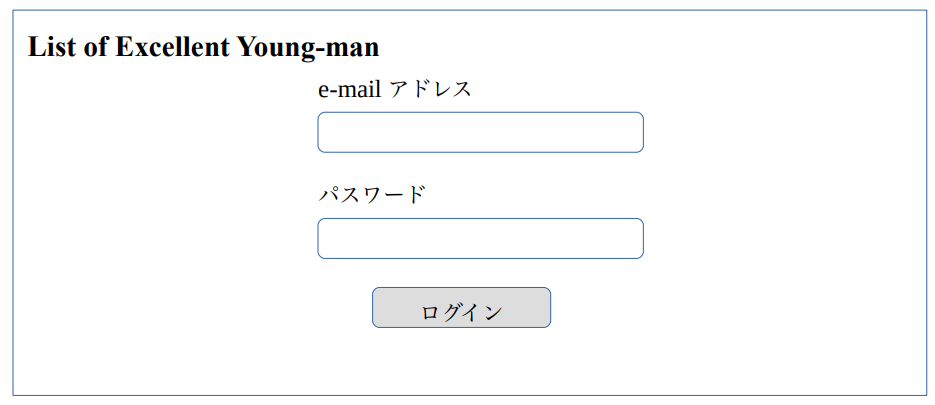
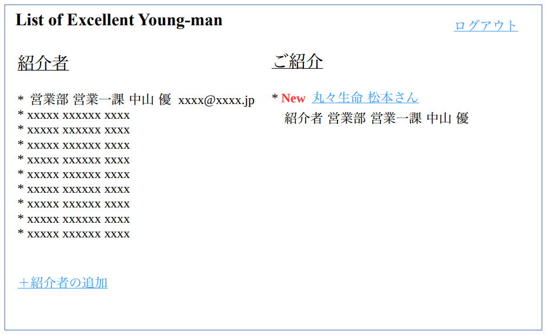

# 機能仕様書

List of Excellent Young-man  
Ver. 1  

## 概要

この List of Excellent Young-man システムは、各部署の社員が人事部に優秀な知り合いを紹介してくれるシステムです。  
このシステムは、佐川さんという人事部 5 年目の女性社員が 1 人でほそぼそと行っていたことを仕組み化しようと企画されました。  

経緯を簡単に説明しますと、人事部が主に利用している採用媒体（リ○ナビなど）を使った採用とは別に、佐川さんは個人的に、各部署の社員から優秀な知り合いを紹介してもらい、それぞれの方に条件や面接時間などを合わせた採用を行っていました。昨年、紹介を通じて採用した方は 7 名いました。その 7 名は、今年度上期の営業部の売上をなんと 20%もアップさせたのです！（営業部は総勢150 人います！）すごい！  

佐川さんは昨年結婚し、その後妊娠したので育児休暇を取ることにしました。育児休暇に入るまであと半年あります。それを受けて取締役から以下のように中期計画の見直しが発表されました。  

- 佐川さんが育児休暇に入る前に、紹介採用を仕組み化する。  
- 2 年後には、紹介採用を採用計画の 50%にあたる 30 名に増やす。  
- 佐川さんが育児休暇中に、人事部の増員はしないこととする。  
- 佐川さんが育児休暇から戻ってからは、子育て支援を中心に新しい取り組みを始める。  

我が社は育休後職場維持制度があり、佐川さんは育休明けに人事部に戻ってきます。紹介採用を仕組み化するため、私たちシステム部がシステムを構築することになったのです。  

### ※※※※ 注意 ※※※※

この仕様書は、どんなに想像力をたくましくしても不完全なものです。すべての文言は完成までに数回は改定される必要があります。掲載されている画面の画像やレイアウトはサンプルです。機能を説明する目的で載せていますので、実際のフィードバックを繰り返しながら、長期にわたって開発されることになるでしょう。  
この仕様書では、各処理で使用されるアルゴリズムや設計については議論しません。これについては別の場所で議論することにします。この仕様書は、List of Excellent Young-man を利用するユーザーが目にする部分についてのみ議論します。  

### ※※※※ 対象外 ※※※※

Ver. 1 では、以下のことはサポートしません。  

- 人事部が紹介いただいた方に対して提案する内容を記録することはできない。  
- 紹介者と人事部の相談の内容を記録することはできない。  
- このシステムで紹介していただいた方の面接の設定はすることができない。  
- このシステムで紹介していただいた方の評価情報の登録はすることができない。  
- 紹介者が自分でメールアドレスやパスワードを変更することはできない。  

## 業務フロー

佐川さんは、人事部 5 年目の中堅社員です。実は彼女は妊娠中で育休予定。そこで彼女のやっている仕事をまとめてシステム化しようとしたのがきっかけで、List of Excellent Young-man のシステ
ム開発がスタートしたのでした。  

佐川さんは、毎月数名の顔が広そうな方にメールなどで事前に「いい人はいませんか？」と声掛けをし、もし時間がもらえれば直接お話を聞いた上で、紹介していただいた方に人事部から直接連絡するという方法をとっていました。1 ヶ月に対応できる人数は 1 人くらいでしたので、ゆっくりじっくりという感じです。採用までには、1 ヶ月で決まる人もいれば、半年かかった人もいました。  

さて、この仕事をシステムにしようという企画が起こりました。佐川さんの業務の流れはこのような流れです。

1. 各部署の顔の広そうな方にメール等で「紹介していただける方はいらっしゃいませんか？」と声をかける。

1. います！と返信があった人のうち、お時間の合う方は直接、お時間がなさそうな場合は、メールでテンプレートに詳細を書いてもらいます。

1. もし他に自社内で知り合いの方がいれば、その方からも情報をもらいます。

1. 先方の給料、いままでの仕事とこれからの仕事のことをいろいろ検討して、こういう感じだったらうまくいきそうか？ということを、紹介していただいた方に聞いてしまいます。

1. その内容をベースに、人事部から正式にオファーをします。もちろん紹介者の方にも、もしよければ飲みなどセッティングしていただいて、お話を聞いてきてもらいます。

1. そこからさらに返信があれば、面接を設定するなどして、そこから先は通常の採用と同じです。面接官には、誰からの紹介であることと事前情報をわたしておきます。

## シナリオ

### シナリオ 1　人事部 村田さん

佐川さんが育児休暇を取得するにあたって、仕事の引き継ぎをすることが決まっている村田さん。佐川さんの 1 つ下の後輩にあたります。佐川さんから、人事部に人材を紹介してくださりそうな方の中から、今月依頼してみたらよい社員のリストを 10 名分もらいました。さっそく List of Excellent Young-man を使って、連絡したいと思います。  

システムにログインして、紹介者の追加から、表示された10名分の入力欄に名前と部署名とメールアドレスを入力します。これで大丈夫かな？メール内容を確認するをクリックすると、メールの本文が出てきました。そこには、「いつも優秀な人材を紹介してくれてありがとうございます。これからも、我が社に入ってくれそうな人材をぜひともご紹介ください。List of Excellent Young-man は、みなさんから人事部に紹介してもいいと思った人たちを登録いただくシステムです。もし人事部から連絡してもよい優秀な方がいらっしゃいましたら、ぜひご登録をお願いします。」と書いてあり、その下に個別のログインパスワードと URL が記載されるようです。どうやらこの文章が 10 名に送信されるようです。入力内容を確認して登録します。これで今月は終わり？？なんだかあっけない。  

紹介者の一覧を見ると、先程入力した 10 名分の名前とメールアドレスが表示されていますので、登録は OK なはずです。あとは返事を待つばかりです。  

```txt
― テクニカルノート ―

シナリオ1では、このシステムを利用して人材を紹介してくださる方のアカウントを発行します  

個別のログインパスワードは、数字と英語の小文字と大文字が混ざったランダムな 8 文字とし
ます。  
```

### シナリオ 2　営業部営業一課 中山さん

中山さんは、優秀な営業マンです。彼は 150 人いる営業部の中で、年間売上トップに幾度となく輝いています。彼が連れてくる人材は、いつも人事部の度肝を抜くことでも有名です。  
彼が始業前の儀式（メールチェック）をしていると、1 通のメールに目が止まりました。人事部が新しくつくったシステム List of Excellent Young-man からの招待メールでした。  

そこには、「いつも優秀な人材を紹介してくれてありがとうございます。これからも、我が社に入ってくれそうな人材をぜひともご紹介ください。List of Excellent Young-man は、みなさんから人事部に紹介してもいいと思った人たちを登録いただくシステムです。もし人事部から連絡してもよい優秀な方がいらっしゃいましたら、ぜひご登録をお願いします。」と書いてありました。「そういえば、丸々生命の松本さんが、うちのことを気にしていたな。彼は今の会社の方針があわなくて、わたしたちをとても羨ましがっていた。営業三課の吉岡さんが大学の後輩だと言っていたな。どれどれ登録してみよう。」さっそく 1 人こころあたりがあるようです。  

中山さんは記載されていたアカウント情報と URL でもってシステムにログインし、「人事部に紹介する」ボタンを押しました。すると、名前、電話番号と E メールのどちらか連絡先、現在の勤め先が必須入力なようです。推薦理由は「転職を検討していたから（給料の不満）」「転職を検討していたから（昇進への不満）」などいくつかの項目がありましたが、「転職を検討していたから（会社方針の不満）」を選びました。"人事部へ提供できる情報" の欄に、「営業三課の吉岡さんが大学の 2 年下の後輩だと言っていました。今つとめている会社の方針が合わないとなげいており、わたしたちが羨ましいと言っていました。」と入力して送信しました。これで松本さんに人事部から連絡が行けば、我が社の営業もますます強くなるなと思いました。  

### シナリオ 3　人事部 村田さん

いつも人事部を驚かせてくれる営業部の中山さんからご紹介いただくことができました。丸々生命の松本さんというかたです。「中山さんにご紹介いただくと採用率がかなり高いのはいいのだけど、いつも情報不足なのよね。」と佐川さんが言っていたことを思い出しました。今回もいつもどおりの展開と言えるでしょう。  

松本さんの情報の下段にある「追加情報を依頼する（紹介者の登録）」から、営業三課の吉岡さんの名前と部署名とメールアドレスを入力しました。メール内容を確認するをクリックすると、メールの本文が出てきました。そこには、「営業一課 中山さんから、丸々生命 松本さんを紹介いただきました。そこで、システムにログインいただき、松本さんの情報に、さらに吉岡さんのご存知な情報を追加いただけないでしょうか？どうぞよろしくお願いいたします。」と書いてありました。これなら追加情報をもらえそうです。入力内容を確認して登録します。  

### シナリオ 4　営業部営業三課 吉岡さん

吉岡さんは、ただいま注目されている若手のエースです。彼は昨年始めて営業三課のなかで売上トップになり、1 年に 1 回優秀な社員に送られる「社長特別賞」を、同期のなかで一番最初に受賞しました。  

ある日、あこがれの中山さんを真似して始業前の儀式（メールチェック）をしていると、1 通のメールに目が止まりました。人事部が新しくつくったシステム List of Excellent Young-man からの招待メールでした。  

そこには、「営業一課 中山さんから、丸々生命 松本さんを紹介いただきました。そこで、システムにログインいただき、松本さんの情報に、さらに吉岡さんのご存知な情報を追加いただけないでしょうか？どうぞよろしくお願いいたします。」と書いてありました。「松本先輩は丸々生命でトップクラスの営業マンだ。中山さんが目をつけるのもうなずけるな。」と思って、記載されていたアカウント情報と URL でシステムにログインしてみました。  

マイページにはいると、「【依頼】営業一課 中山さんからご紹介 丸々生命 松本さんの追加情報をご入力ください。」と表示されていました。クリックすると、「営業三課の吉岡さんが大学の 2 年下の後輩だと言っていました。今つとめている会社の方針が合わないとなげいており、わたしたちが羨ましいと言っていました。」と中山さんが入力した情報が確認できました。「あーそういえば、部署の方針が合わないって言ってたな。働く時間の割には給料が安いとかも言っていたな。」など、いろいろ思い出してきました。そして、"人事部へ提供できる情報" の欄に、「松本先輩には大学時代にかなりお世話になりました。学年は 2 年上で、現在 30 歳だったと思います。松本先輩は丸々生命の営業部門で年間売上トップをとったこともあるかなりすごい方で、尊敬しています。我が社に来てくださるならすごくうれしいです。中山さんがおっしゃっている通り、いま勤めている会社の方針が合わないとおっしゃっていました。新規の飛び込み営業を全員に続けさせることに嫌悪感があり、取締役と何度か衝突していると聞いています。」と入力して送信しました。  

中山さんに一度相談してから松本先輩とお酒でも飲もうかなと思いました。  

### シナリオ 5　人事部 村田さん

吉岡さんから追加情報が入力されたことを確認しました。この情報を人事部のほうで利用していきます。松本さんに提案する仕事の内容とお給料、これを決めて、それから中山さんと再度相談して、松本さんに実際に声をかけていきます。  

※※ Ver.1 はここまで ※※  

## 画面ごとの仕様

List of Excellent Young-man システムは、かなりの数の異なる画面から構成されます。多くの画面は標準的なフォーマットに従います。このシステムは、社内で使用するシステムであるため、ルックアンドフィールは将来グラフィックデザイナーによってデザインされる予定はありません。システムエンジニアによって選択されたいくつかの CSS フレームワークのうちから、 [Bootstrap](https://getbootstrap.jp/) を使う予定です。  

すべての画面には正式名称をあたえることとします。他のドキュメントでも、この機能仕様書で付与される正式名称（画面名）を利用することにしましょう。  
正式名称の例：ログインフォーム、マイページ、紹介者の追加、人事部に紹介する  

### ログインフォーム

ログインフォームは紹介者がログインするため（紹介者以外の人がログインしないようにするため）に存在します。これは次のような外観をしています。

  

```txt
― テクニカルノート ―

e-mail アドレスは `input type="email" required` パスワードは `input type="password" required` を使用することで、バリデーションの実装を省略します。
```

1. 入力された e-mail アドレスとパスワードが正しくない場合、「入力された情報ではログインができませんでした。もう一度入力内容をお確かめください。」と e-mail アドレスのうえに赤文字でメッセージを表示します。  

1. 1 の場合、さらにパスワードがすべて大文字の場合、「Caps Lock キーがオンになっていませんか？」というメッセージを追加します。  

1. e-mail アドレスとパスワードが正しい場合、マイページに移します。

```txt
― テクニカルノート ―

パスワードは不可逆変換をおこない、データベースに登録することが望ましい。
```

### マイページ

マイページはすべての動作の起点となる画面です。人事部用のマイページと紹介者用のマイページは別になります。次に示すのは、人事部用のマイページです。  

  

### 紹介者の追加

### 人事部に紹介する

※ ※ ※ ※ ※ ※ ※ ※ ※ ※ ※ ※ ※ ※ ※ ※ ※ ※ ※ ※ ※ ※ ※ ※ ※ ※ ※ ※ ※ ※ ※ ※ ※ ※ ※ ※

機能仕様書はここまでです。以後の画面や仕様については、文章から類推して進めてください。
